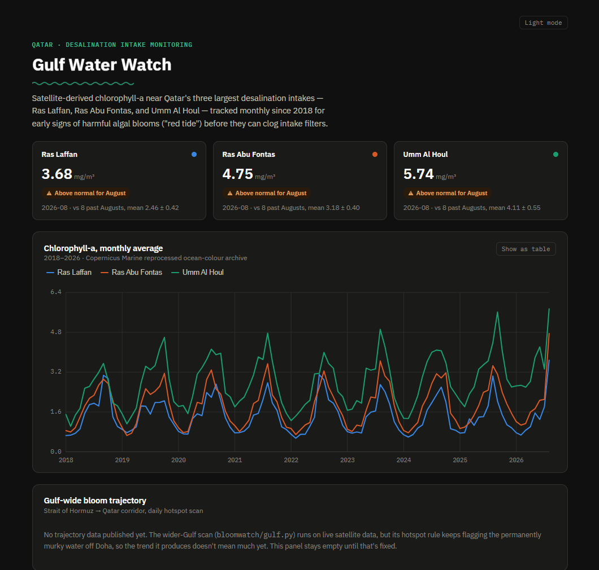

# Gulf Water Watch

Qatar gets almost all of its drinking water from desalination plants. If a harmful algal
bloom (red tide) reaches one of their intakes, it can clog the filters and shut the plant
down. This already happened in the region. In 2008 a bloom of *Cochlodinium polykrikoides*
started in the Gulf of Oman, spread into the Arabian Gulf and reached Qatari waters.
Desalination plants in the UAE and Oman had to go offline for weeks.

Satellites can see chlorophyll building up in the water days before a bloom hits the
coast. So I built this to watch Qatar's three largest intakes (Ras Laffan, Ras Abu Fontas
and Umm Al Houl) using free satellite data, and flag anything unusual.

Live site: https://qatar-gulf-water-watch.vercel.app



## What it does

Every day it downloads the newest chlorophyll-a scene from Copernicus Marine and averages
a small box, about 5 km wide, around each intake. If a reading is more than 2 standard
deviations above that intake's own history, it gets flagged.

Chlorophyll here goes up every summer, so a spike in August doesn't mean much by itself.
That's why the dashboard compares each month with the same month in past years instead of
a year-round average. Otherwise every normal summer would show up as a warning.

It also scans the wider Gulf, from the Strait of Hormuz to Qatar, for patches of water that
are unusual for that exact spot and time of year, and checks whether the nearest one is
getting closer over ten days. A GitHub Actions workflow is set up to run all of this every
morning and record anything it flags on the website.

There's also a backtest that runs the same check on the real 2008 bloom. It picked out
water about 70 km from where the bloom started on 19 and 22 August 2008, a few days before
the bloom was first reported. To see if that meant anything, I ran the same check on the
same weeks of August in 14 other years, and it found anything like that in only one of them
(2017). The website has a map you can play through, check by check, for the whole bloom.

There's no trained ML model, and that's on purpose. The region only has one or two
documented bloom events, which isn't enough to learn anything real from. A model trained
on that would just memorise noise. The reasoning behind this and my other choices is in
[DECISIONS.md](docs/DECISIONS.md).

## Status

This is a prototype. It isn't an operational warning system yet.

| Part | State |
|---|---|
| Daily intake check, 2018–2026 monthly history | Run on real Copernicus data |
| Wider-Gulf scan, 10-day trajectory | Run on real data; the hotspot rule was redesigned after the first real runs |
| 2008 backtest | Run on real 2008 data, compared with the same weeks in 14 other years |
| Current projection | Only tested on made-up data so far |
| Intake coordinates, alert thresholds | Approximate, not tuned |

What's left to do is in [ROADMAP.md](docs/ROADMAP.md).

## Repository

```
bloomwatch/               Python pipeline: fetch, detect, trajectory, projection, backtest
tests/                    Offline tests for the pipeline's logic
qatar_dashboard/          Static dashboard: one self-contained index.html, no server needed
qatar_dashboard_react/    The same dashboard in React + Vite (the deployed version)
docs/                     Architecture, design decisions, runbook, roadmap
```

## Running it

The Python pipeline needs a free [Copernicus Marine](https://marine.copernicus.eu) account:

```bash
pip install -e ".[dev]"
copernicusmarine login
python -m pytest               # offline tests, no login needed
python -m bloomwatch daily     # the daily steps, in order
python -m bloomwatch --help    # every command
```

The React dashboard:

```bash
cd qatar_dashboard_react
npm install
npm run dev      # http://localhost:5173
npm run build    # static site in dist/
```

The [runbook](docs/RUNBOOK.md) has more detail, like scheduling and deploying to Vercel.

## Data

The chlorophyll-a data comes from the [Copernicus Marine Service](https://marine.copernicus.eu)
ocean-colour products (multi-sensor, 4 km). The background on the 2008 bloom is from
Richlen et al., "The catastrophic 2008–2009 red tide in the Arabian gulf region",
*Harmful Algae* (2010).

## How this was built

I used an AI coding assistant (Claude) to help build this. I decided what the project
does and made the design calls in [DECISIONS.md](docs/DECISIONS.md), and I run, test and
review everything before it goes in. If something has only been tested on made-up data or
isn't verified yet, the code and docs say so.

## License

[MIT](LICENSE)
